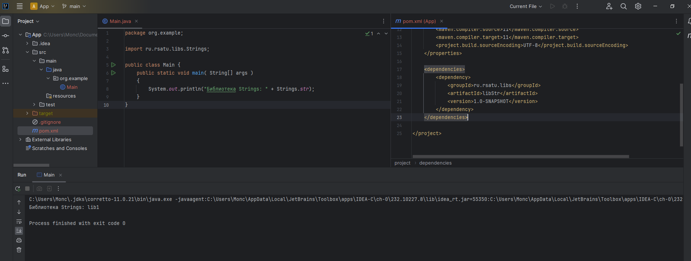
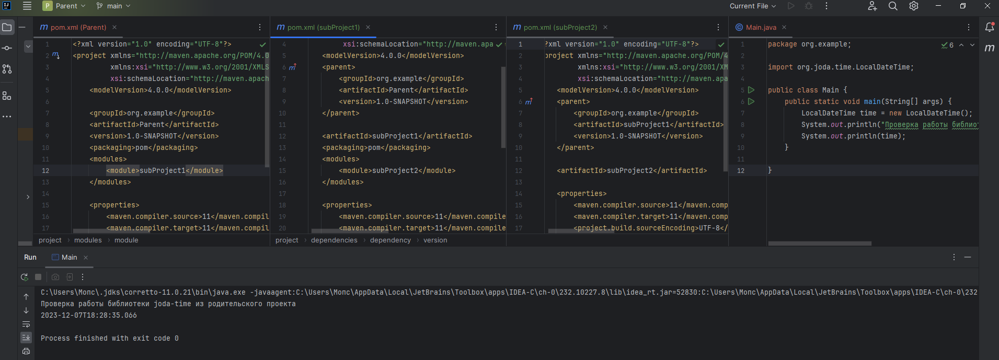

# Отчет по лабораторной работе №2  

Подготовил: Костин Ростислав, ИПБ-21  

## Цель и задачи

1. Добавить jar библиотеку в локальный репозиторий maven. Подключить ее как
зависимость и продемонстрировать работу.
2. Создать родительский проект и два дочерних с помощью maven. Один
дочерний зависим от другого.

## Выполнение  

### 1. Использование своей библиотеки с помощью maven

Сначала я создал проект с системой сборки maven, далее добавил класс:

```java
package ru.rsatu.libs;

public class Strings {
    public static String str = "lib1";
}
```

После в командной строке прописал  
`mvn install`
и в локальном репозитории создалась jar библиотека с классом Strings.  

  

Создал новый проект, назвав его App, и в pom в секцию __dependencies__ была прописана зависимость из локального репозитория на мою только что созданную библиотеку следующим образом:

```text
<dependency>
    <groupId>ru.rsatu.libs</groupId>
    <artifactId>libStr</artifactId>
    <version>1.0-SNAPSHOT</version>
</dependency>
```

Далее в главной функции мы вызываем значение `str` из нашей библиотеки.

```java
package org.example;

import ru.rsatu.libs.Strings;

public class Main {
    public static void main( String[] args )
    {
        System.out.println("Библиотека Strings: " + Strings.str);
    }
}
```

### 2. Создание зависимостей между родительским и дочерними проектами  

Для начала я создал родительский проект (_parent_). Далее был создан первый дочерний проект (_subProject1_), к которому подключена зависимость joda-time. Потом создан второй дочерний проект (_subProject2_), в котором будет использоваться joda-time.

В pom родительского проекта добавлена секция __modules__ для подключения первого
дочернего проекта.  

```text
<modules>
    <module>subProject1</module>
</modules>
```

В первый дочерний проект добавлены секции __modules__ и __parent__.

```text
<parent>
    <artifactId>parent</artifactId>
    <groupId>org.example</groupId>
    <version>1.0-SNAPSHOT</version>
</parent>

<modules>
    <module>subProject2</module>
</modules>
```

Ко второму дочернему проекту добавлена секция __parent__.

```text
<parent>
    <groupId>org.example</groupId>
    <artifactId>subProject1</artifactId>
    <version>1.0-SNAPSHOT</version>
</parent>
```

Далее мы вызываем в главной функции _subProject2_  `LocalDateTime()`, используя при этом библиотеку joda.time, которая была подлкючена в _subProject1_.

```java
package org.example;

import org.joda.time.LocalDateTime;

public class Main {
    public static void main(String[] args) {
        LocalDateTime time = new LocalDateTime();
        System.out.println("Проверка работы библиотеки joda-time из родительского проекта");
        System.out.println(time);
    }
}
```

## Результат разработки

В результате выполнения первого задания было получено содержимое библиотеки,
созданной в локальном репозитории.  



[Исходник библиотеки](libStr)  
[Исходник проекта, вызывающий библиотеку](App)

В результате выполнения второго задания с помощью joda-time (добавленного к
первому дочернему проекту) во втором дочернем выведены дата и время.



[Исходник 2 задания](Parent)  

## Вывод

В результате выполнения лабораторной работы я познакомился с maven.
Научился создавать проект с помощью maven, подключать локальные и внешние
зависимости, а также создавать зависимости между родительским и дочерними
проектами.  
